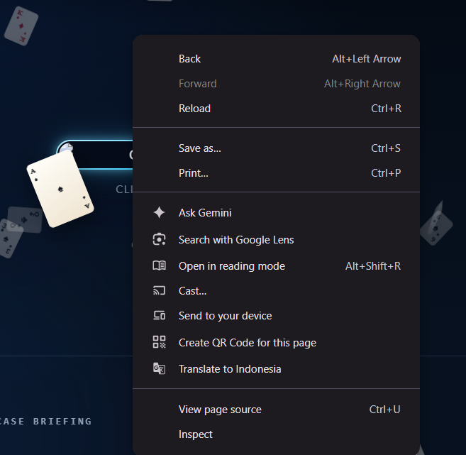
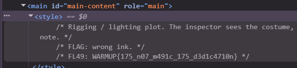

# Kaito CTF - Welcome Flag

- Write-Up Author: Ravi
- Category: Beginner
- Flag: `WARMUP{175_n07_m491c_175_d3d1c4710n}`

## Challenge Description

Challenge pembuka yang menguji kemampuan dasar reconnaissance pada tampilan web.

## Langkah Menemukan Flag

1. Buka homepage dan cari hint berupa ikon **spade card** di menu.

   <!-- SCREENSHOT: homepage dengan icon spade card -->
   

2. Klik kanan ikon tersebut, lalu **Inspect** untuk membuka poster di dalam logo spade.

   <!-- SCREENSHOT: inspect element poster -->
   

3. Setelah inspect, lihat bagian **style** dari elemen tersebut. Flag tersembunyi di sana.

   <!-- SCREENSHOT: style element berisi flag -->
   

## Kesimpulan

Flag disembunyikan sebagai nilai properti CSS pada elemen spade card. Teknik ini termasuk variasi dari *hidden in plain sight* yang bisa ditemukan lewat inspection elemen.

**Flag:** `WARMUP{175_n07_m491c_175_d3d1c4710n}`
