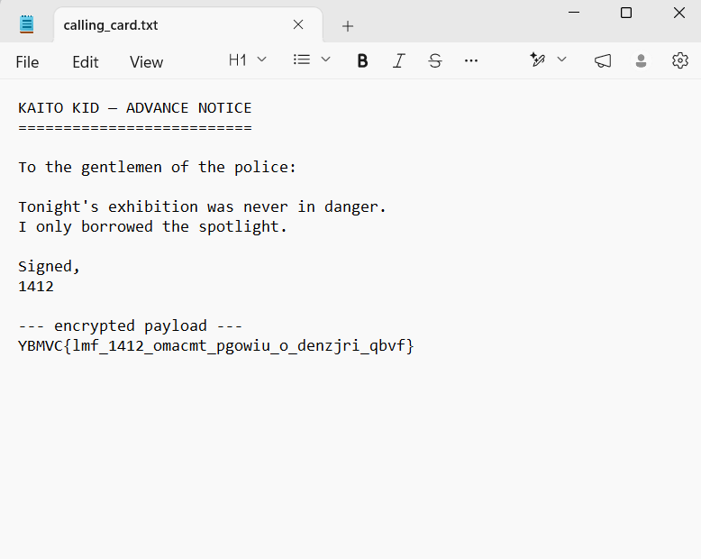
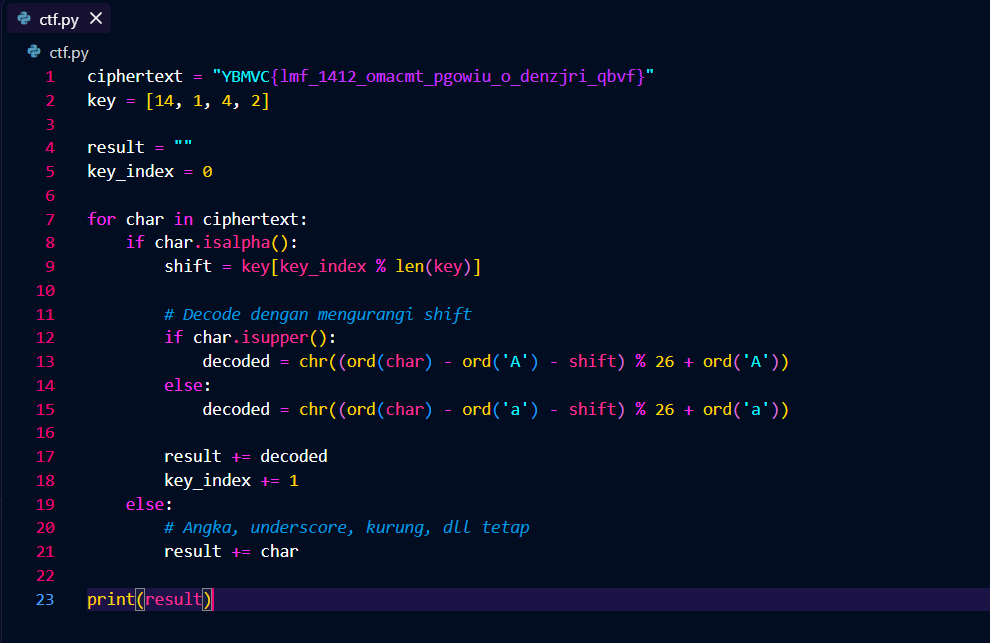

# Kaito CTF - Kid1412

- Write-Up Author: Ravi
- Category: Beginner
- Flag: `KAITO{kid_1412_always_leaves_a_calling_card}`

## Challenge Description

> Kaito Kid always sends an advance notice before a heist. This time he left an encrypted payload beneath his signature: 1412.
> Conan left a few notes in his casefile. Decode the calling card.
> **Author: Gojo Satoru**

## Analisis

Diberikan sebuah payload terenkripsi sederhana.

<!-- SCREENSHOT: payload terenkripsi -->


Petunjuk utamanya ada pada angka **1412** pada signature. Angka ini adalah pola shift dari **Caesar cipher** yang dipakai berulang:

```
14 > 1 > 4 > 2 > 14 > 1 ...
```

## Langkah Menemukan Flag

1. Ambil payload yang diberikan.
2. Terapkan shift berulang sesuai pola `14, 1, 4, 2` ke tiap karakter payload.

   ```
   Y - 14 = K
   B - 1  = A
   M - 4  = I
   V - 2  = T
   C - 14 = O
   ```

3. Tulis script Python untuk otomasi decode:

   <!-- SCREENSHOT: kode python decode -->
   

4. Jalankan script, hasilnya adalah flag.

## Kesimpulan

Payload didekripsi menggunakan Caesar shift dengan pola `1412` yang berulang. Angka pada signature berfungsi sebagai kunci pola shift.

**Flag:** `KAITO{kid_1412_always_leaves_a_calling_card}`
