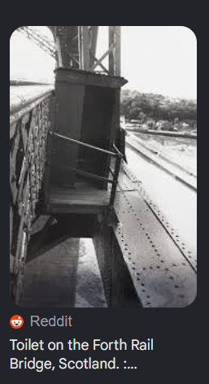
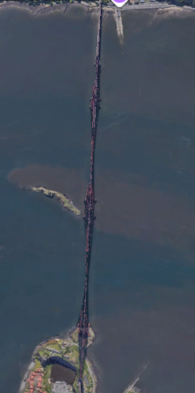
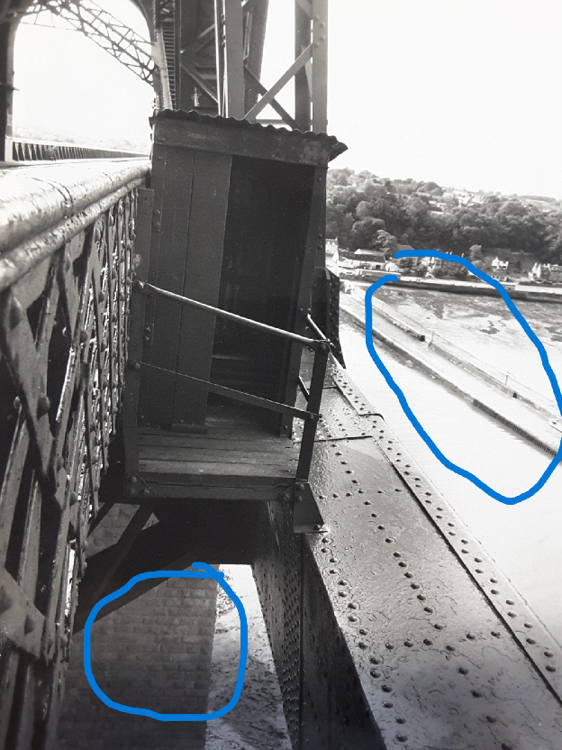
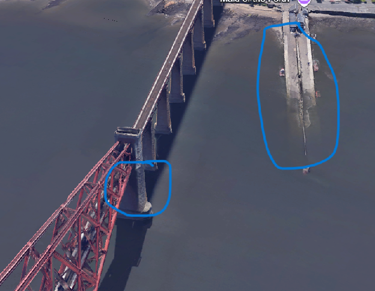
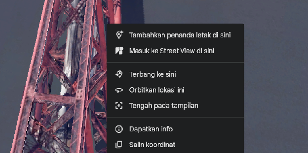

# Kaito CTF - What a Good Spot

- Write-Up Author: Ravi
- Category: OSINT
- Flag: `Kaito{55.994,-3.385}`

## Challenge Description

> Contractor was told to pick a spot with good ventilation.
> They bolted a wooden shed to the side of a rail bridge, 150 feet over the water, and called it a day. Honestly? What a good spot.
> Find the coordinates of this toilet.
> Flag format: `Kaito{lat,lon}` to 3 decimal places
> Example: `Kaito{12.123,4.567}`

## Analisis

Diberikan sebuah foto tanpa informasi lokasi. Targetnya adalah menemukan koordinat sebuah "toilet" — gubuk kayu yang ditempel di sisi jembatan rel di atas air. 

## Langkah Menemukan Flag

1. **Google Lens** untuk menemukan lokasi asli foto tersebut:

   

2. Cari di **Google Maps / Earth** lokasinya:

   

3. Perhatikan **detail pada foto**:

   

4. **Cocokkan detail** dengan lokasi di foto:

   

5. **Temukan titik koordinatnya**:

   

6. **Ubah koordinat ke desimal**:

   ```
   55°59'39.4"N 3°23'07.9"W
   = 55.994267, -3.385536
   ```

7. Format sesuai flag format (3 desimal) → flag.

## Kesimpulan

Challenge ini murni geolocation OSINT. Foto diidentifikasi lewat Google Lens, diverifikasi dengan mencocokkan detail visual pada Google Maps/Earth, lalu koordinat DMS dikonversi ke desimal sesuai format flag.

**Flag:** `Kaito{55.994,-3.385}`
